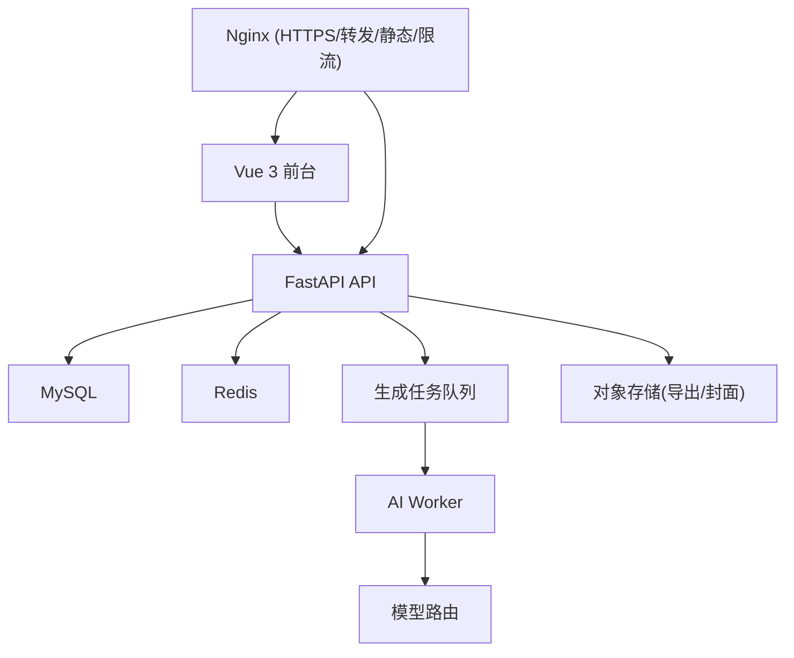

# 12 · 部署规范

## 目标架构



各组件职责：

- **Vue 3**：创作工作台、案例阅读、账号与支付。
- **FastAPI**：用户、项目、额度、订单、任务 API。
- **MySQL**：业务数据。
- **Redis**：每日额度、限流、任务状态、短期缓存。
- **Worker**：章节生成、摘要、记忆更新、内容审核（异步，避免请求超时）。
- **对象存储**：导出文件、封面、大历史版本。
- **Nginx**：HTTPS、API 转发、静态资源、限流。

第一阶段不需要微服务：一个 FastAPI + 一个 Worker 足够。

## Docker Compose（必须交付）

服务：`nginx`、`frontend`（构建产物由 nginx 托管）、`backend`、`worker`、`mysql`、`redis`。要求：

- 所有敏感值通过 `.env`（`env_file`）注入，`.env` 不入库（提供 `.env.example`）。
- MySQL/Redis 端口仅 `127.0.0.1` 暴露（或仅在 compose 内网，不发布到宿主）。
- backend 与 worker 共用同一镜像/代码，入口不同（uvicorn vs worker loop）。
- 健康检查：backend `/health/ready`；compose `depends_on` + healthcheck。

## 部署流程（沿用现网实践）

1. 构建后端镜像（带版本 tag，如 `lyread-backend:v2-YYYYMMDD-HHMMSS`）。
2. 迁移数据库（幂等迁移脚本，先备份 `mysqldump`）。
3. 起新容器 → 健康检查 `/health/ready` → 失败自动回滚到上一个镜像 tag。
4. 前端 `npm run build` → 部署到 nginx web root → `nginx -t && systemctl reload nginx`。
5. 保留回滚镜像 tag 与 DB 备份。

## 环境变量清单（backend/worker）

```text
APP_ENV=production
APP_VERSION=2.0.0
ALLOWED_ORIGINS=https://lyread.cn,https://www.lyread.cn
MYSQL_HOST/PORT/USER/PASSWORD/DATABASE
REDIS_URL=redis://:PASSWORD@lyread-redis:6379/0
JWT_SECRET=<>=32 chars>
JWT_EXPIRE_MINUTES=60
DEEPSEEK_API_KEY / DEEPSEEK_BASE_URL / DEEPSEEK_MODEL
ALIPAY_APP_ID / ALIPAY_PRIVATE_KEY / ALIPAY_PUBLIC_KEY / ALIPAY_GATEWAY / ALIPAY_NOTIFY_URL
AUTO_EVOLUTION=1
EVOLUTION_INTERVAL_SECONDS=900
```

## 监控与运维

- cron/systemd 看门狗：`/health/live` 异常自动重启（现网已配 8004 看门狗）。
- 日志集中；生成任务成本与失败率可观测。
- 支付宝：先沙箱，后正式；正式回调 URL 走 HTTPS。

## 测试环境 → 上线节奏

1. 部署测试域名，接支付宝沙箱、测试模型额度。
2. 连续生成 ≥20 章，模拟失败与退款，检查越权。
3. 小规模上线：邀请 10–30 用户，观察首次生成完成率、退出点、付费转化、每章成本、人物混乱出现的章数。
